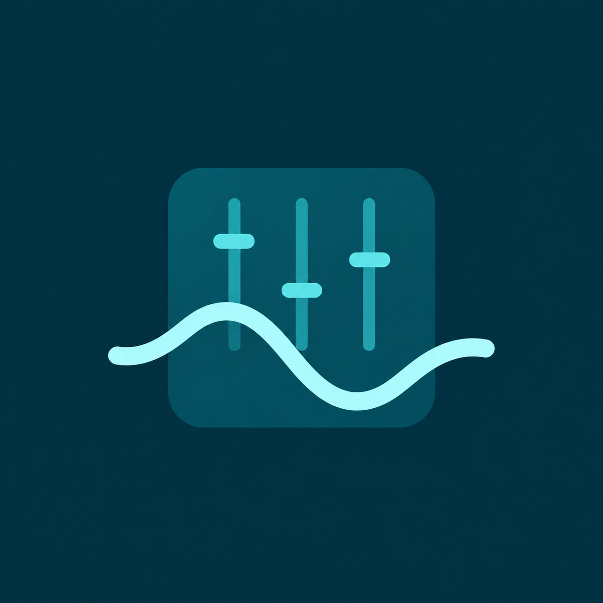

# Just Meter

**清晰看见每一段声音。**

[English](#english) · [构建说明 / Build](docs/BUILDING.md) · [MIT License](LICENSE)

Just Meter 是一款面向 macOS 的频谱与响度测量工具，提供独立应用和 VST3 插件。

它将频谱、响度、历史曲线和立体声信息放在同一个界面中，采用 macOS 原生玻璃材质，支持浅色、深色与跟随系统外观。你可以根据自己的工作习惯，调整组件的位置、尺寸和显示内容。

## 主要功能

- **频谱分析**：实时频谱显示，支持捕获参考曲线。
- **响度测量**：整段响度、瞬时响度、短时响度、响度范围与最大瞬时响度。
- **峰值监测**：真峰值、采样峰值与峰值保持。
- **立体声观察**：向量图、相关度与左右平衡。
- **历史与导出**：查看响度变化，导出 CSV 测量记录。
- **自定义布局**：支持 1×1、1×2、2×1、2×2 组件，调整排列、显示数据并保存布局预设。
- **外观调整**：浅色与深色模式、背景透明度、界面缩放，以及独立应用窗口置顶。
- **中英文支持**：软件内可即时切换语言，安装器跟随 macOS 的语言显示。

响度单位支持 LUFS、LKFS 和相对 LU，相对参考值可以自行设置。

## 两种使用方式

**独立应用**

测量系统播放的声音、默认音频输入，或导入音频文件进行离线分析。

**VST3 插件**

在支持 VST3 的 DAW 中挂载，测量轨道或总线音频。插件让音频原样通过，不进行增益调整、响度校正或限幅。

## 下载与安装

当前预览版本适用于：

- Apple Silicon Mac
- macOS 26 或更高版本
- 插件使用需要支持原生 Apple Silicon VST3 的宿主

在仓库的 **Releases** 页面下载安装包。安装前退出 Just Meter 和正在运行的 DAW，然后选择安装独立应用、VST3 插件，或同时安装两者。

安装程序会自动放到以下位置：

- 独立应用：`/Applications/Just Meter.app`
- VST3：`/Library/Audio/Plug-Ins/VST3/Just Meter.vst3`

安装完成后，在 DAW 中扫描插件并搜索 **Just Meter**。升级用户应避免同时保留旧的手动安装副本；若 DAW 缓存过失败记录，可能需要重新扫描。

## 开始使用

打开独立应用，在左下角选择音频来源。首次使用系统音频或音频输入时，需要授予对应的 macOS 录制权限。

点击右上角设置，可调整语言、外观、布局和测量选项。

语言切换位置：**设置 → 外观 → 语言 / Language**。

音频分析在本机完成，不上传音频内容。

## 当前版本说明

**0.1.3 是预览版本。** 当前安装包尚未完成 Developer ID 正式签名与 Apple 公证，下载后可能遇到 macOS 安全提示或插件扫描拦截。

已通过 DSP 数值测试、VST3 validator 的 47 项校验，以及原生测试宿主的界面加载和音频原样通过检查。不同 DAW、设备与长时间运行的兼容性仍在持续验证。

当前提供 macOS Apple Silicon 的独立应用与 VST3；暂不提供 Intel、Windows 或 AU 版本。

## 作者与致谢

**Yee Huang**
联系邮箱：yeehuang2002@163.com

本项目使用 AI 辅助开发，采用 [MIT 许可证](LICENSE)。

响度计算使用 libebur128，插件接口使用 Steinberg VST3 SDK。第三方许可证随应用与插件一并提供，详见 [第三方说明](THIRD_PARTY_NOTICES.md)。

---

# English

**See your sound clearly.**

Just Meter is a native spectrum and loudness meter for macOS, available as a standalone app and a VST3 plug-in.

Spectrum, loudness, history and stereo information share a customizable interface built with native macOS glass materials. Arrange widgets, choose the information they display, and switch between light, dark and system appearance.

## Features

- Real-time spectrum analysis with reference curves.
- Integrated, momentary and short-term loudness, loudness range and maximum momentary loudness.
- True peak, sample peak and peak hold.
- Stereo vectorscope, correlation and balance.
- Loudness history and CSV export.
- Custom layouts with 1×1, 1×2, 2×1 and 2×2 widgets.
- Adjustable transparency and interface scale, plus an always-on-top option for the standalone app.
- Chinese and English interfaces, with a localized installer.

Loudness units include LUFS, LKFS and relative LU with an adjustable reference level.

## Standalone App and VST3

Use the standalone app to measure system audio, the default audio input, or imported audio files.

Use the VST3 plug-in to measure tracks and buses in a compatible DAW. Audio passes through unchanged, without gain adjustment, loudness correction or limiting.

## Download and Install

Requires an **Apple Silicon Mac running macOS 26 or later**. The plug-in requires a host that supports native Apple Silicon VST3 plug-ins.

Download the installer from **Releases**. Quit Just Meter and your DAW, then choose the standalone app, VST3 plug-in, or both.

Installation locations:

- App: `/Applications/Just Meter.app`
- VST3: `/Library/Audio/Plug-Ins/VST3/Just Meter.vst3`

Scan plug-ins in your DAW and search for **Just Meter**. When upgrading, avoid keeping older manually installed duplicates. A rescan may be needed if your DAW cached an earlier scan failure.

## Getting Started

In the standalone app, select an audio source from the lower-left corner. System audio and audio input require the corresponding macOS recording permissions.

Open Settings to adjust appearance, layouts and measurement options.

Change language in **Settings → Appearance → Language / 语言**.

Audio is processed locally and is not uploaded.

## Preview Status

**Version 0.1.3 is a preview.** The installer does not yet have Developer ID signing or Apple notarization. macOS may display security warnings or block plug-in scanning.

DSP tests, all 47 VST3 validator checks, native editor loading and bit-identical audio pass-through checks have passed. Compatibility across DAWs, devices and extended sessions remains under evaluation.

This release provides a macOS Apple Silicon app and VST3 plug-in. Intel, Windows and AU builds are not currently available.

## Author and Credits

**Yee Huang**
Contact: yeehuang2002@163.com

Developed with AI assistance. Released under the [MIT License](LICENSE).

Loudness measurement uses libebur128. Plug-in integration uses the Steinberg VST3 SDK. Third-party licenses are included with the app and plug-in. See [third-party notices](THIRD_PARTY_NOTICES.md) and [build instructions](docs/BUILDING.md).
